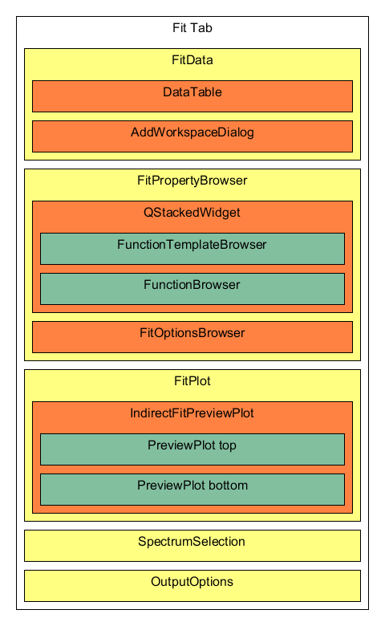
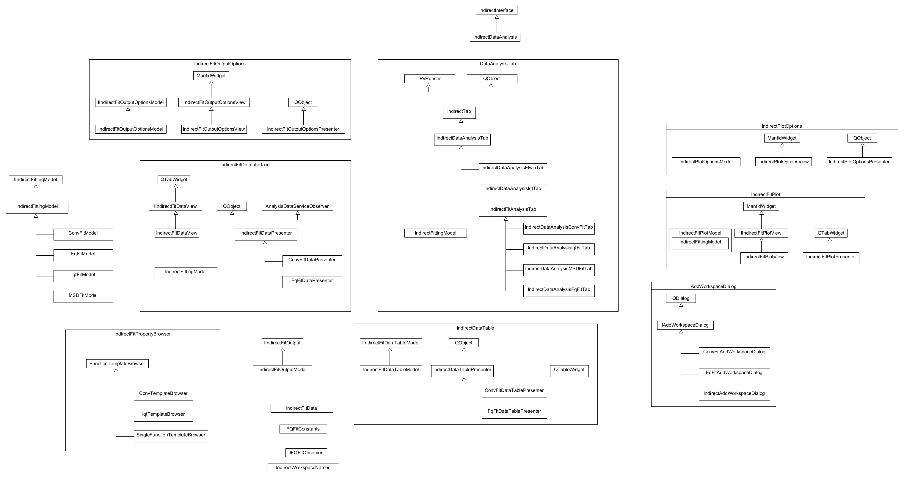

.. _IDA-Structure-ref:

IndirectDataAnalysis File Structure
===================================

The many levels of inheritance in the indirect data analysis codebase can be confusing. it is not always clear how they
all interact, part of the refactor is to make things clear.

The Ewlin and I(Q,t) are the most different as their components are all contained within a single UI file. This is
something that should be fixed to be more modular but it could be left till the fit tabs are separated out entirely.

Fit Tab structure
=================

The QENS fit tabs in Inelastic Data analysis have this general structure. different tabs will feature different derived
classes for the IndirectFitAnalysisTab, FitDataView, FunctionTemplateBrowser, and the AddWorkspaceDialog

QENS file class structure
=========================

This image will need updating as changes are made to the structure.

The ideal structure for the interface should include MVP for each defined section. Currently the IndirectFitting Model
is used in multiple places so that the interfaces can all communicate with the same object. A latter refactor issue will
make each use their own model and have them communicate only with objects that they own and with their parent.