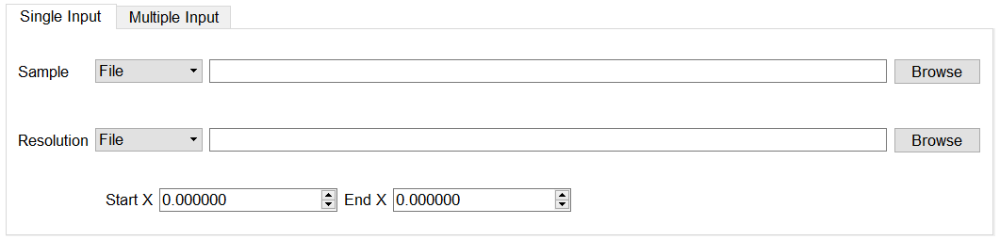
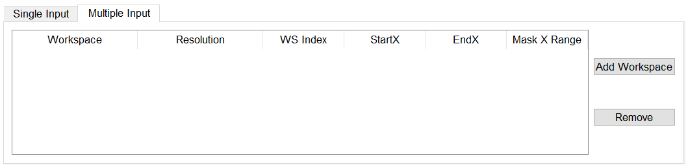

.. _QENS-fitting-ref:

QENS Fitting
============

.. contents:: Table of Contents
  :local:

.. figure::  ../../images/QENS/ConvFitTab.png
   :height: 1000px
   :align: center

There are four QENS fitting interfaces:

* :ref:`MSD Fit <MsdFit-ref>`
* :ref:`I(Q,t) Fit <IqtFit-ref>`
* :ref:`Conv Fit <ConvFit-ref>`
* :ref:`F(Q) Fit <FqFit-ref>`

These fitting interfaces share common features, with a few unique options in each.

Data Input
~~~~~~~~~~

Each interface provides the option to choose between selecting one or multiple data files to be fit.
The selected mode can be changed by clicking either the 'Single Input' tab or 'Multiple Input' tab at the the top
of the interface to switch between selecting one or multiple data files respectively.
Data may either be provided as a file, or selected from workspaces which have already been loaded.

Single Input
------------

When selecting 'Single Input' a sample workspaces can be added either from a file or workspace that had already been
loaded. The resolution is only available in :ref:`Conv Fit <ConvFit-ref>`. All spectra in the workspace will be loaded
into the interface and the fit range for them can be set from the 'Start X' and 'End X' boxes. To select specific
spectra to fit use the 'Spectrum Selection' area (see below)

Multiple Input
--------------

When selecting 'Multiple Input', a table along with two buttons 'Add Workspace' and 'Remove' will be displayed.
Clicking 'Add Workspace' will allow you to add a new data-set to the fit (this will bring up a dialog allowing you
to select a file/workspace and the spectra to load). Once the data has been loaded, it will be displayed in the table.
Highlighting data in the table and selecting 'Remove' will allow you to remove data from the fit. Above the preview
plots there is a drop-down menu with which can be used to select the active data-set, which will be shown in the plots.

Sequential and Simultaneous fits
~~~~~~~~~~~~~~~~~~~~~~~~~~~~~~~~

There are options to fit your selected spectra either Sequentially or Simultaneously.

A :ref:`sequential fit <algm-IqtFitSequential>` will fit each spectra one after another. By default this will use the
end values of one fit as the starting values of the next. This behaviour can be toggled using the sequential/individual
option.

A :ref:`simultaneous fit <algm-IqtFitSimultaneous>` will fit all the selected spectra against one cost function. The
primary advantage of this method is that parameters which are expected to be constant across the data range can be tied
across all the spectra. This leads to these parameters being fitted with better statistics and hence reduced errors.

Fit Function
~~~~~~~~~~~~

.. figure::  ../../images/QENS/ConvFitFunctionSelection.png
   :height: 500px
   :align: right

Under 'Fit Function', you can view the selected model and associated parameters as well as make modifications.

There are two modes which can be used to select functions. The default version allows easy selection of the most
commonly used function models. The options in this mode differ for each of the four fitting tabs so more detailed
information is given in their specific documentation. The other mode, which may be switched to by ticking the
`See full function` box, displays the generic function browser in which any function model can be specified.

Parameters may be tied by right-clicking on a parameter and selecting either 'Tie > To Function' to tie the parameter
to a parameter of the same name in a different function, or by selecting 'Tie > Custom Tie' to tie to parameters of
different names and for providing mathematical expressions. Parameters can be constrained by right-clicking and
using the available options under 'Constrain'.

Upon performing a fit, the parameter values will be updated here to display the result of the fit for the selected
spectrum.

Settings
~~~~~~~~
The bottom half of the Fit Function section contains a table of settings which control what sort of fit is done. These
are:

Fitting
  Controls whether to do a sequential or simultaneous fit.

Max Iterations
  The maximum number of iterations used to perform the fit of each spectrum.

Minimizer
  The minimizer used for the fit (defaults to Levenberg-Marquadt).

Cost function
  The cost function used for the fit (defaults to Least Squares).

Evaluate Function As
  The way the function is evaluated on histogram data sets. If the value is “CentrePoint” then function is evaluated at
  centre of each bin. If it is “Histogram” then function is integrated within the bin and the integrals returned.

Fit Type
  Only available in sequential fits. Controls whether each fit is initialised from the end values of the previous fit.

Preview Plots
~~~~~~~~~~~~~

.. figure::  ../../images/QENS/ConvFitPlotPreview.png
   :height: 1000px

Two preview plots are included in each of the fitting interfaces. The top preview plot displays the sample, guess
and fit curves. The bottom preview plot displays the difference curve.

The preview plots will display the curves for the selected spectrum ('Plot Spectrum') of the selected data-set
(when in multiple input mode, a drop-down menu will be available above the plots to select the active data-set).

The 'Plot Spectrum' option can be used to select the active/displayed spectrum.

A button labelled 'Fit Single Spectrum' is found under the preview plots and can be used to perform a fit of the
selected specturm.

'Plot Current Preview' can be used to plot the sample, fit, and difference curves of the selected spectrum in
a separate plotting window.

The 'Plot Guess' check-box can be used to enable/disable the guess curve which will plot the curve currently described
by the fit function.

Spectrum Selection
~~~~~~~~~~~~~~~~~~

In MsdFit, IqtFit and ConvFit below the fit model selection and preview plots, the spectra to be fit can be selected.
The 'Fit Spectra' drop-down menu provides two options ('Range' and 'String') to specificity the fit spectra. If 'Range'
is selected, you are able to select a range of spectra to fit by providing the upper and lower bounds. If 'String' is
selected you can provide the spectra to fit in a text form. When selecting spectra using text, you can use '-' to
identify a range and ',' to separate each spectrum/range.

:math:`X`-Ranges may be excluded from the fit by selecting a spectrum next to the 'Mask Bins of Spectrum' label and
then providing a comma-separated list of pairs, where each pair designates a range to exclude from the fit.

This is disabled when multiple input is selected.

Output
~~~~~~

The results of the fit may be plotted and saved under the 'Output' section of the fitting interfaces.

Next to the 'Plot' label, you can select a parameter to plot and then click 'Plot' to plot it with error
bars across the fit spectra (if multiple data-sets have been used, a separate plot will be produced for each data-set).
The 'Plot Output' options will be disabled after a fit if there is only one data point for the parameters.

During a sequential fit, the parameters calculated for one spectrum are used as the initial parameters for the next
spectrum to be fitted. Although this normally yields better parameter values for the later spectra, it can also lead to
poorly fitted parameters if the next spectrum is not 'related' to the previous spectrum. It may be useful to replace
this poorly fitted spectrum with the results from a single fit using the 'Edit Result' option. Clicking the 'Edit
Result' button will allow you to modify the data within your *_Results* workspace using the results produced from a fit
to a single spectrum. See the algorithm :ref:`IndirectReplaceFitResult <algm-IndirectReplaceFitResult>`.

Clicking the 'Save Result' button will save the result of the fit to your default save location.

Bayesian (FABADA minimizer)
~~~~~~~~~~~~~~~~~~~~~~~~~~~

There is the option to perform Bayesian data analysis on the I(Q, t) Fit ConvFit
tabs on this interface by using the :ref:`FABADA` fitting minimizer, however in
order to to use this you will need to use better starting parameters than the
defaults provided by the interface.

You may also experience issues where the starting parameters may give a reliable
fit on one spectra but not others, in this case the best option is to reduce
the number of spectra that are fitted in one operation.

In both I(Q, t) Fit and ConvFit the following options are available when fitting
using FABADA:

Output Chain
  Select to enable output of the FABADA chain when using FABADA as the fitting
  minimizer.

Chain Length
  Number of further steps carried out by fitting algorithm once the parameters have
  converged (see *ChainLength* is :ref:`FABADA` documentation)

Convergence Criteria
  The minimum variation in the cost function before the parameters are
  considered to have converged (see *ConvergenceCriteria* in :ref:`FABADA`
  documentation)

Acceptance Rate
  The desired percentage acceptance of new parameters (see *JumpAcceptanceRate*
  in :ref:`FABADA` documentation)

The FABADA minimizer can output a PDF group workspace when the PDF option is ticked. If this happens,
then it is possible to plot this PDF data using the output options at the bottom of the tabs.

:ref:`Indirect Data Analysis <interface-inelastic-data-analysis>`

.. categories:: Interfaces Indirect Direct
